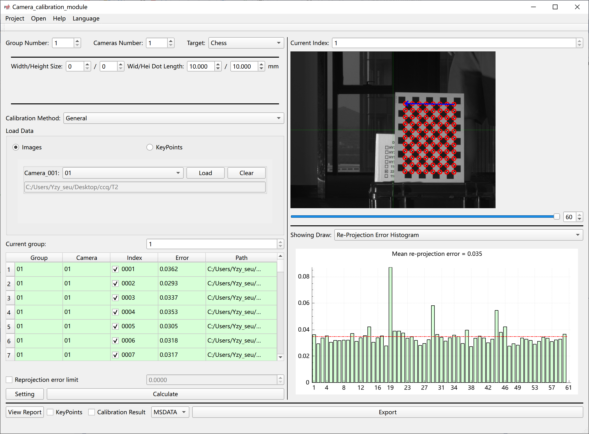
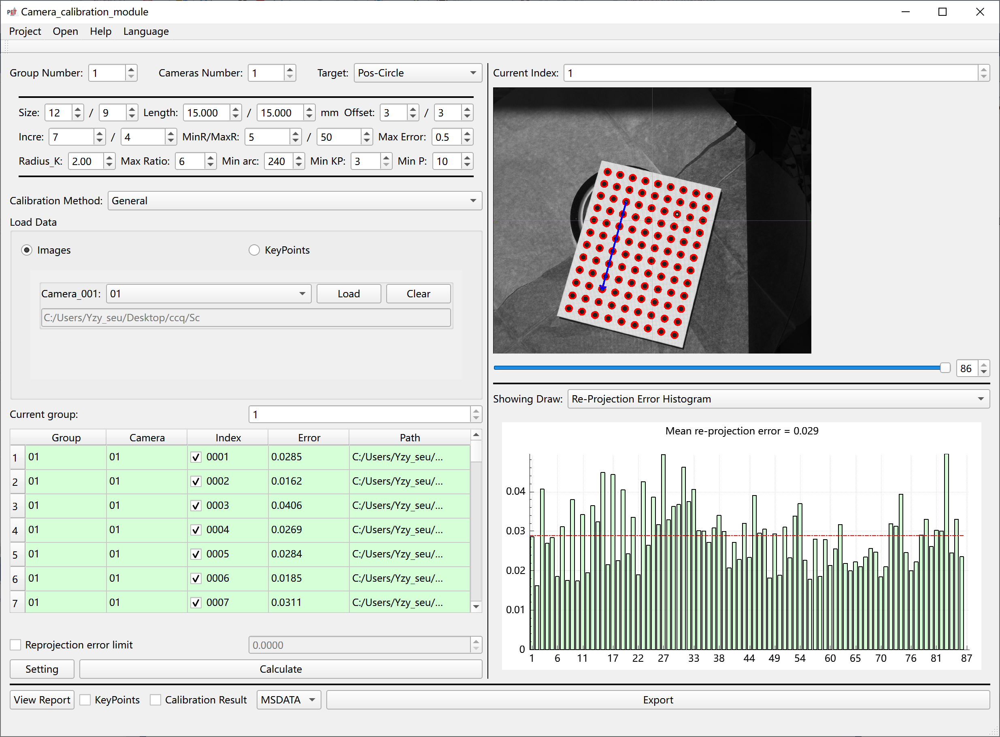
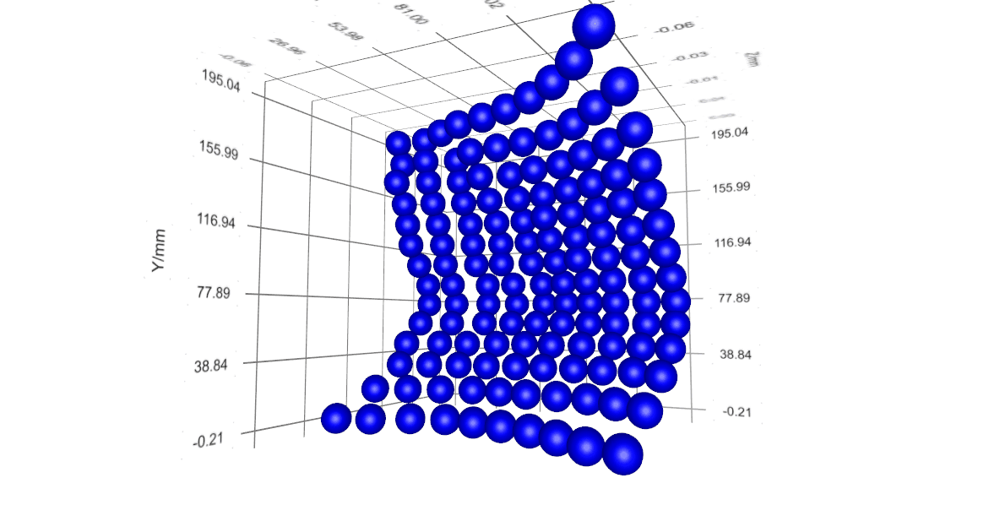

# Multi_Camera_Calibration  
The original purpose of Multi Camera Calibration Library (MMCL) was to serve **Photomechanics** methods such as Digital Image Correlation (DIC) and Fringe Projection.  
Multi_Camera_Calibration library can be used for multi camera calibration. It mainly includes the following functions:  
1. Identification calibration board: chessboard, circle grid (updating), circle grid with directional circles (CSI/VIC), and speckle (updating).
  
  
2. Optimization of calibration board morphology under multi camera constraints  
  
3. Output corner data and calibration results (*.csv/*.mat/*.txt/*.msdata).The format of the msdata file has been defined in Format_Document.h.
  
  
Dependency library:  
1. Ceres  
2. Opencv  
3. Matlab (only for *.MAT file output supported)
  
  
There is still a portion of the work that needs to be waited for:  
1. The module supporting speckle calibration board needs to be updated after the paper is publicly published.  
2. Currently, the project can only support dual cameras, and the joint optimization of multiple cameras also needs to be updated after the paper is published.  
Researchers interested in these can follow the authors YIN,ZHUOYI(Southeast University) in Google Scholar.

